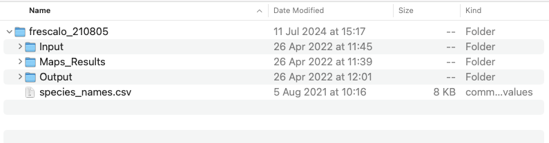

```{r setup, include=FALSE}
library(knitr)
opts_chunk$set(echo = TRUE, cache=TRUE)
```

\

<div class="alert alert-info">
#### About this document
In this document, we will go through a number of functions that we have written in order to extract some useful information and metrics from the output of a Frescalo analysis ([Hill, 2012](https://doi.org/10.1111/j.2041-210X.2011.00146.x)).
</div>


## Preparations
These functions use outputs from [the `sparta` package](https://biologicalrecordscentre.github.io/sparta/index.html), and this tutorial assumes that you have run the `frescalo()` function, that in itself requires some data wrangling and other pre-functions to be run. See the [`sparta` vignettes](http://biologicalrecordscentre.github.io/sparta/articles/sparta_vignette.html) for details.

If you have done that, then you should have a folder on your machine containing the output from the `frescalo()` function. The folder will be named *frescalo_yymmdd*, according to the date on which the analysis was carried out, and the location of the folder should have been specified in the `sinkdir` argument of the `fresalo()` function. Something like this.


\

### Example data
The data used for this tutorial are from the island of Öland in southern Sweden. A delightful place with an interesting flora. For 295 vascular plant species, [Historical observations](https://www.diva-portal.org/smash/get/diva2:565427/FULLTEXT01.pdf) (note: the link is to a scanned book) mapped in 1938 were digitised, and these were compared to observations from the [modern flora](https://svenskbotanik.se/nyheter/olands-flora/) that was published in 2024. Each observation was assigned to a 5 × 5 km grid cell using the old Swedish national grid RT90. As well as being used to assess changes in occurrences and distribution in the modern flora, comparisons of species' trends using the Frescalo method have also been used in my research (for example [Auffret & Svenning 2022](https://www.nature.com/articles/s41467-022-35516-7)). The data are available on the Swedish observation system [ArtPortalen](https://artportalen.se).


### Import the functions
```{r, eval=TRUE, collapse=TRUE, fig.show='hold', out.width="50%"}
source("frescFun.R")
```
\

## The functions
Here will follow descriptions of five functions.


### `frescImport()`: Import Frescalo outputs to the workspace

<div class="alert alert-success">
#### Description
Takes a folder containing frescalo outputs and makes list that can be used with rest of the functions.

#### Usage
`frescImport(folder)`

#### Arguments
`folder`    The location of the folder

#### Value
A list containing eight objects. The list resembles the output list from the `frescalo()` function, with many items assigned the same names. However, not all of the items are actually used by subsequent functions, and we also bring in some additional files that are needed, but are otherwise not returned automatically by `frescalo()`. The aim is to find a balance between being able to run the functions below, but also being able to explore the frescalo output if needed.

</div>
\

#### Example

```{r, eval=TRUE, collapse=TRUE, fig.show='hold', out.width="50%"}
out.path <- "data/frescalo_210805"

fresc.res <- frescImport(out.path)

lapply(fresc.res, head) # take a peek
```
\
\


### `frescS_it()`: Calculate recorder effort per grid square and time period

<div class="alert alert-success">
#### Description
Takes an output list from `frescImport()` and returns recorder effort per grid square and time period. Recorder effort is defined as the proportion of each grid square's neighbourhood's benchmark species that were observed in the focal grid square during a particular time period. This is known as S~it~ in Hill (2012). 

#### Usage
`frescS_it(frescalo.results)`

#### Arguments
`frescalo.results`    A list output from the `frescImport()` function.

#### Details
This function first uses the log file from the Frescalo output to identify the proportion of benchmark species used for the Frescalo analysis, known as R* in Hill (2012) and specified as the `alpha` argument in `sparta::frescalo`. It then for each grid square identifies the benchmark species for the neighbourhood (which are common across all time periods) and calculates the proportion that were observed in each time period.

#### Value
A data frame with a column with grid square names, and an additional column for each time period in the analysis containing the proportion of benchmark species.
</div>
\

#### Example

```{r, eval=TRUE, collapse=TRUE, fig.show='hold', out.width="50%"}
fresc.samp <- frescS_it(fresc.res)

fresc.samp # take a peek
```
\

By plotting these outputs, we see that the modern flora has a much higher sampling effort than the historical inventory. In the case of this data set, this is completely expected.
```{r, eval=TRUE, collapse=TRUE, fig.show='hold', out.width="50%"}

hist(fresc.samp[,2], main=names(fresc.samp)[2], xlim=c(0,1), xlab="Proportion benchmark species")
hist(fresc.samp[,3], main=names(fresc.samp)[3], xlim=c(0,1), xlab="Proportion benchmark species")

```
\
\


### `frescTrends()`: Estimate occurrence trends for each species over time

<div class="alert alert-success">
#### Description
Takes an output list from `frescImport()` and returns metrics of occurrence trends used in the literature.

#### Usage
`frescTrends(frescalo.results, return.all=TRUE)`

#### Arguments
`frescalo.results`    A list output from the `frescImport()` function.<br>
`return.all`    Logical. Specify if you not only want trend data for each species, but also random draws of species trends for nice plotting (see details, as well as `frescPescPlot()` below)

#### Details
This function returns metrics of relative occupancy and change in relative occupancy for each species in each time period, as well as changes over time and a measure of uncertainty, following some publications that have used the Frescalo method. The term relative occupancy is taken from [Pescott et al. 2022](https://doi.org/10.1016/j.ecolind.2022.109117). It is originally known as Time factor in Hill, 2012, and called Relative Reporting Rate in [Fox et al. 2014](https://doi.org/10.1111/1365-2664.12256). The function extracts the relative occupancy values from the Frescalo output, and applies a Z-test on the earliest and most recent time periods of the data, according to the equation given in Fox et al. 2014. This value of change over time is (comfortingly) identical to the value 'b' in the `sparta()` output's lm_stats object. The function also calculates linear models based on 100 random draws from the standard deviations of the relative occupancy values for each species over time. The distributions of the slopes of these linear models are split according to their strength into the following categories: "Strong decline", "Moderate decline", "Stable", "Moderate increase", "Strong increase", according to Pescott et al. 2022. 

#### Value
If `return.all=FALSE` a data frame with a column for species names, columns relating to relative occupancy and z-tests, as well as the proportion of linear model slopes that fall into the above categories. If `return.all=TRUE`, a list is returned, with the first object `trends` being the above-described data frame. The second object is a list of the linear model outputs for each species, and the third gives the time period names - both of these are required for running the `frescPescPlot()` function.
</div>
\

#### Example

```{r, eval=TRUE, collapse=TRUE, fig.show='hold', out.width="50%"}
fresc.trends <- frescTrends(fresc.res, return.all=TRUE) # can take some seconds

length(fresc.trends) # just to show that the list contains three items, printing any of it would get a bit messy
```
\

Now to look at the main trends data frame.
```{r}
fresc.trends$trends
```
\


### `frescPescPlot()`: Create plots of trends in relative occupancy for a species

<div class="alert alert-success">
#### Description
Takes a species name and an output from `frescTrends()` and returns a nice plot in the style of [Pescott et al. 2022](https://doi.org/10.1016/j.ecolind.2022.109117) and the wonderful [Plant Atlas 2020](https://plantatlas2020.org) of Britain and Ireland.

#### Usage
`frescPescPlot(species, trends, point.col="black", line.col="forestgreen")`

#### Arguments
`species`    Character. The name of a species that has been analysed using Frescalo, and for which trends have been estimated using `FrescTrends()`.<br>
`trends`    An output list from the `FrescTrends()` function.<br>
`point.col`   Character. The colour to be used for the plot's points.<br>
`line.col`    Character. The colour to be used for the plot's trend lines.

#### Value
A plot with a point and whiskers showing the relative occupancy for the species at each time period, and trend lines for the 100 linear models run in `FrescTrends()`
</div>
\

#### Example

Here we can look at trends in the grassland specialist *Ajuga pyramidalis*, or pyramidal bugle.
```{r, eval=TRUE, collapse=TRUE, fig.show='hold', out.width="75%"}
frescPescPlot("Ajuga pyramidalis", fresc.trends, point.col="black", line.col="forestgreen")
```
\
\


We can try another species, and play around with the colours a little. These plots can also be combined with a histogram of the strength of the trend lines calculated in the previous function, and also used in Pescott et al. 2022 and the plant atlas.
```{r, eval=TRUE, collapse=TRUE, fig.show='hold', out.width="50%"}
my.species <- "Pyrola minor" 

frescPescPlot(my.species, fresc.trends, point.col="blue", line.col="brown")

# extract values from relevant columns in the trends data frame
strength.cols <- c("Strong decline", "Moderate decline", "Stable", "Moderate increase", "Strong increase")
my.species.num <- unlist(fresc.trends$trends[fresc.trends$trends$species==my.species ,strength.cols])

barplot(my.species.num, cex.names=0.75) # and plot
```
\
\

### `frescP_ijt()`: Estimate probability of occurrence for each species per grid square and time period

<div class="alert alert-success">
#### Description
Takes an output list from `frescImport()` and returns estimated probability of occurrence for each species per grid square and time period, as implemented by [Eichenberg et al. 2021](https://doi.org/10.1111/gcb.15447). This is known as P~ijt~ in Hill (2012). 

#### Usage
`frescP_ijt(frescalo.results)`

#### Arguments
`frescalo.results`    A list output from the `frescImport()` function.

#### Details
Equation 2 (and 3) in Hill (2012) estimates probability of occurrence of a given species in a given grid cell at a given time period, based on the species' time-independent frequency in its neighbourhood (i.e. all observations across all time periods), recorder effort at the grid cell at the specific time period (S~it~), and the relative occurrence across the whole study region at the specific time period. By assuming full recorder effort in a specific grid cell at each time period, Eichenberg et al. estimate each species' probability of occurrence. While Hill uses grid-square probability of occurrence to estimate regional-level trends, Eichenberg uses these estimated regional trends to re-estimate grid-square occurrence probability, therefore assuming that a species' grid-square occurrence reflects its regional-level relative occupancy. The combination of time-independent frequency and regional-level relative occurrence also means that a species will receive a non-zero probability of occurrence in a grid cell at a given time period if it has occurred somewhere in its neighbourhood during another time period. In an extreme example, a species that has disappeared from a target grid square from one time period to the next, but has a high time-independent neighbourhood frequency (for instance, it was ubiquitous in the first time period), and has increased regionally (relative occurrence is higher in the second time period), will still have a high probability of occurrence in the target grid square in the second time period according to this method.

#### Value
A data frame with a column with grid square names, species names, and an additional column for each time period in the analysis containing the estimated probability of occurrence.
</div>
\

#### Example

```{r, eval=TRUE, collapse=TRUE, fig.show='hold', out.width="50%"}
fresc.prob <- frescP_ijt(fresc.res) # can take some seconds

fresc.prob # take a peek

fresc.prob[fresc.prob$grid.square=="3G6h",] # look at a specific grid square
```
\

In Eichenberg et al. (2021), these probabilities of occurrences were summed per grid square to produce an estimate of species richness, but please see 'Details' in the box above.
```{r, eval=TRUE, collapse=TRUE, fig.show='hold', out.width="50%"}
est.rich <- aggregate(fresc.prob[,3:ncol(fresc.prob)], list(fresc.prob$grid.square), FUN="sum")

est.rich # take a peek
```
\
\

***
End of document